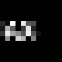
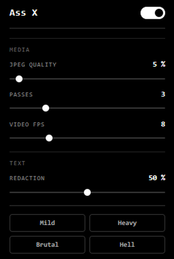
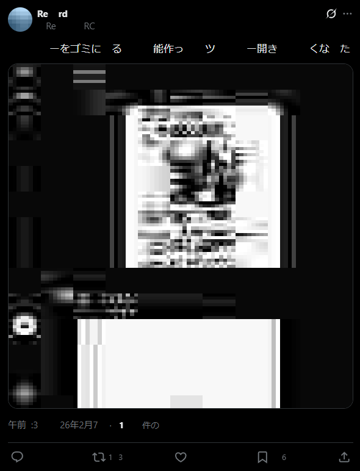

  

<h1 align="center">Ass X</h1>

  A Chrome extension that turns X into ASS

---

## Installation

1. Download or clone this repository
2. Open `chrome://extensions/` in Chrome
3. Enable **Developer mode** (top-right toggle)
4. Click **Load unpacked** and select this folder

## Settings

  
  

## Privacy

Ass X operates entirely within your browser. No data is collected, transmitted, or stored externally. See [PRIVACY.md](PRIVACY.md) for details.

---

## インストール

1. このリポジトリをダウンロードまたはクローン
2. Chromeで `chrome://extensions/` を開く
3. 右上の**デベロッパーモード**を有効化
4. **パッケージ化されていない拡張機能を読み込む**をクリックし、このフォルダを選択

## プライバシー

Ass Xはブラウザ内で完結して動作します。データの収集・送信・外部保存は一切行いません。詳細は [PRIVACY.md](PRIVACY.md) をご覧ください。

---

## License

MIT License

Copyright (c) 2025

Permission is hereby granted, free of charge, to any person obtaining a copy
of this software and associated documentation files (the "Software"), to deal
in the Software without restriction, including without limitation the rights
to use, copy, modify, merge, publish, distribute, sublicense, and/or sell
copies of the Software, and to permit persons to whom the Software is
furnished to do so, subject to the following conditions:

The above copyright notice and this permission notice shall be included in all
copies or substantial portions of the Software.

THE SOFTWARE IS PROVIDED "AS IS", WITHOUT WARRANTY OF ANY KIND, EXPRESS OR
IMPLIED, INCLUDING BUT NOT LIMITED TO THE WARRANTIES OF MERCHANTABILITY,
FITNESS FOR A PARTICULAR PURPOSE AND NONINFRINGEMENT. IN NO EVENT SHALL THE
AUTHORS OR COPYRIGHT HOLDERS BE LIABLE FOR ANY CLAIM, DAMAGES OR OTHER
LIABILITY, WHETHER IN AN ACTION OF CONTRACT, TORT OR OTHERWISE, ARISING FROM,
OUT OF OR IN CONNECTION WITH THE SOFTWARE OR THE USE OR OTHER DEALINGS IN THE
SOFTWARE.
